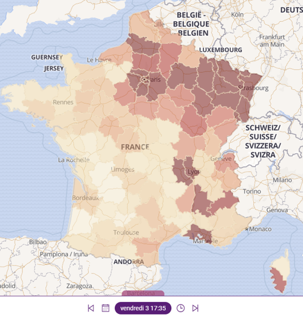

# CQP GEOM

Ce dépôt contient les supports de formation pour les sessions assurées par les intervenants Kalisio sur le CQP GEOM (géomaticien développeur d’applications spatiales).

## Bloc 2 - Traiter, analyser et diffuser les données

A l'issu des différentes unités les stagiaires sont capables de traiter de façon automatisée des données liées à la COVID-19 fournies par les pouvoirs public afin de produire une carte:

### Unité 5 - L’analyse et le traitement des donnees issues d’un SIG

#### S18

Travaux pratiques prévus sur une journée:
* démonstration d'applications opérationnelles illustrant la chaîne complète pour couvrir un besoin,
* introduction aux outils de développement afférents,
* focus sur la spécificité des données spatio-temporelles,
* reprise du fil rouge et analyse des données COVID-19.

Le support est disponible  en ligne [ici](https://docs.google.com/presentation/d/1grH4O70qP_dDWy47xgNpttliFySam_cig4olWJNSnJM) et [ici](./KALISIO%20-%20U5%20-%20S18.pdf) en version imprimable.

#### S19

Travaux pratiques prévus sur une journée:
* présentation et installation de [krawler](https://kalisio.github.io/krawler/),
* acquisition et transformation de données,
* croisement de données (limites administratives/population),
* calcul d’indicateur (taux d'hospitalisation).

Le support est disponible  en ligne [ici](https://docs.google.com/presentation/d/1kBdJKmmuZ1Mtx3dckcFc5FN4DhWyLLASNdj7xdG-mfk) et [ici](./KALISIO%20-%20U5%20-%20S19.pdf) en version imprimable.

Les solutions sont disponibles dans le dossier :open_file_folder: [covid19](./covid19)

### Unité 6 -La mise en forme, l’edition et la diffusion des productions

#### S21

Travaux pratiques prévus sur une demi-journée:
* présentation et installation de [kano](https://kalisio.github.io/kano/),
* configuration pour couches provenant de services OGC (QGIS Server),
* configuration pour diffusion de cartes COVID-19 (2D/3D),
* configuration de la sémiologie,
* configuration pour scénario dynamique évoluant avec le temps.

Le support est disponible  en ligne [ici](https://docs.google.com/presentation/d/1Evjmnw4wijwrE8C8M_mCkN7W3vdmtjEUrEYpJD4tmYk) et [ici](./KALISIO%20-%20U5%20-%20S21.pdf) en version imprimable.

Les solutions sont disponibles dans le dossier :open_file_folder: [kano](./covid19)

